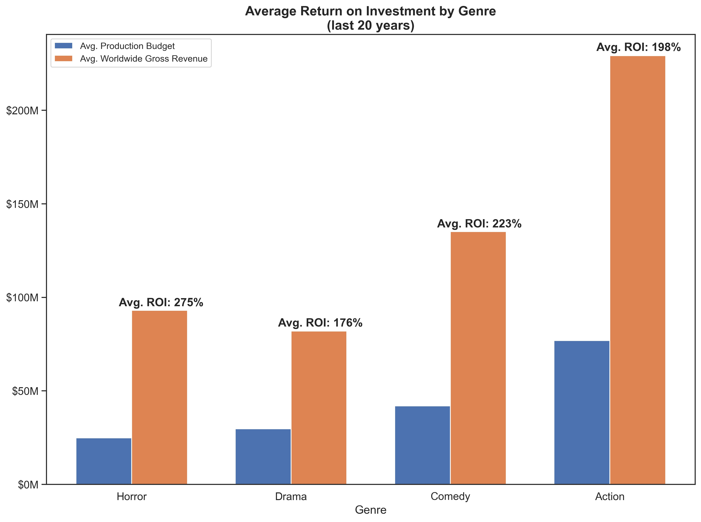
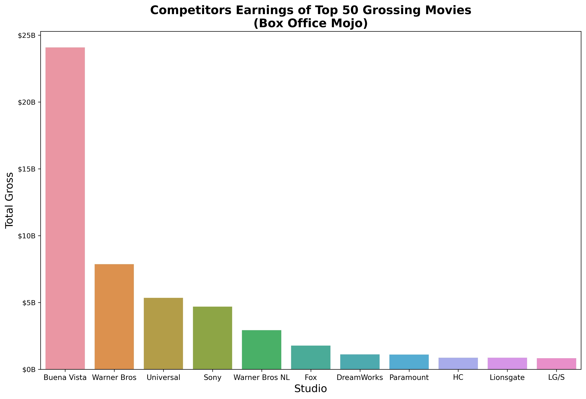
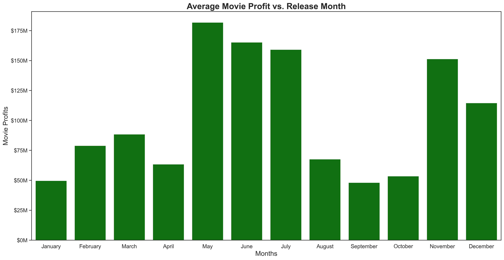

# Movie Analysis for Microsoft Studios

**Authors**: [Paul Lindquist](https://www.linkedin.com/in/paul-lindquist/), [Steven Addison](https://www.linkedin.com/in/addisonse/), [Sumedh Bhardwaj](https://www.linkedin.com/in/sumedh-bhardwaj-932767202/), [Wahaj Dar](https://www.linkedin.com/in/wahaj-dar-/)

## Overview
This project postulates that Microsoft is launching a movie studio. We use exploratory data analysis to pitch recommendations to their stakeholders.

## Business Problem
As this is a new venture for Microsoft, we want to be cognizant of cost and profitability. We offer several, data-driven approaches to maximize return.

Questions we'll answer:
* What genres of movies are lower risk to target as an entry point into the industry?
* Are there types of movies or specific directors and actors that yield higher revenues?
* Who are Microsoft's competitors and can anything be modeled from their successes?
    * Does Microsoft already have a catalogue of content that can be turned into movie franchises?
* When is the most profitable time to release movies?

## Data
We use historical and categorical data from the box office and current movie landscape – release date, directors, actors, etc. – to examine correlations.

Focuses:
* Particular focus given to cost (budget) and gross revenue (worldwide)
* Drawing a correlation between revenue and genres, directors, actors, release date, etc.
* Sourced from: [Box Office Mojo](https://www.boxofficemojo.com/), [The Numbers](https://www.the-numbers.com/), [IMDB](https://www.imdb.com/)

## Methods
This project uses descriptive analysis.

## Results
Horror movies yield the lowest average cost and highest average profit margins, offering a strategic, lower-risk entry point into the industry:



A handful of directors helm movies that historically yield high revenues. It would be worthwhile exploring the availability of these directors to direct a big budget movie:


The top 2 competing studios with the highest revenues (Buena Vista/Disney, Warner Bros) own blockbuster comic book franchises (Marvel, DC Comics, respectively). A comparable franchise could be fashioned from high-grossing Microsoft games (Halo, Gears of War, Forza Motorsport, etc.):



Target the release month of big budget movies for May, June or July, as these 3 months historically yield the highest average revenues:



## Conclusions
Based on our analysis, we make the following suggestions for the business:

* **An early focus should be placed on making horror movies.** According to the data, they historically yield the lowest average cost and highest average profit margins. They'll serve as an initial, lower-risk entry point.
* **When moving into big budget, blockbuster movies, target specific directors and/or actors who've historically yielded high box office revenues.** Top 3 directors: Russo brothers, Joss Whedon, James Wan. Top 3 actors: Robert Downey Jr., Chris Evans, Dwayne 'The Rock' Johnson. Top 3 actresses: Scarlett Johansson, Jennifer Lawrence, Bryce Dallas Howard.
* **Explore creating movie franchises out of Microsoft intellectual property, namely video games.** The top 2 competing studios with the highest revenues (Buena Vista/Disney, Warner Bros) own Marvel and DC comics, respectively. A comparable franchise could be fashioned from high-grossing Microsoft games (Halo, Gears of War, Forza Motorsport, etc.)
* **Release big budget movies in May, June or July.** These 3 months historically yield the highest average revenues.

## For More Information
Please review our full analysis in our [Jupyter Notebook](./Group_4_Notebook_FINAL.ipynb) or [presentation deck](./Project_Presentation.pdf).

For additional questions, please contact [Paul](mailto:paullindquist@fastmail.com), [Steven](mailto:steven.e.addison@gmail.com), [Sumedh](mailto:sumedhubhardwaj@yahoo.com) or [Wahaj](mailto:wahajdar95@gmail.com).

## Repository Structure
```
├── README.md                           <- The top-level README for reviewers of this project
├── Group_4_Notebook_FINAL.ipynb        <- Narrative documentation of analysis in Jupyter notebook
├── Project_Presentation.pdf            <- PDF version of project presentation
├── data                                <- Both sourced externally and generated from code
└── images                              <- Both sourced externally and generated from code
```
